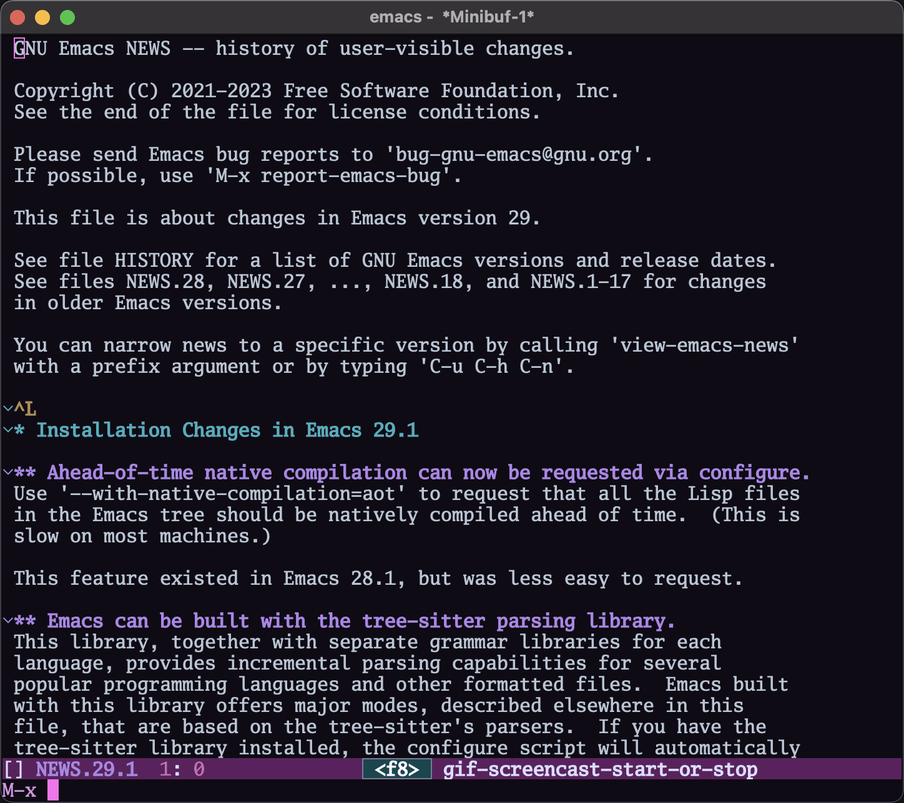
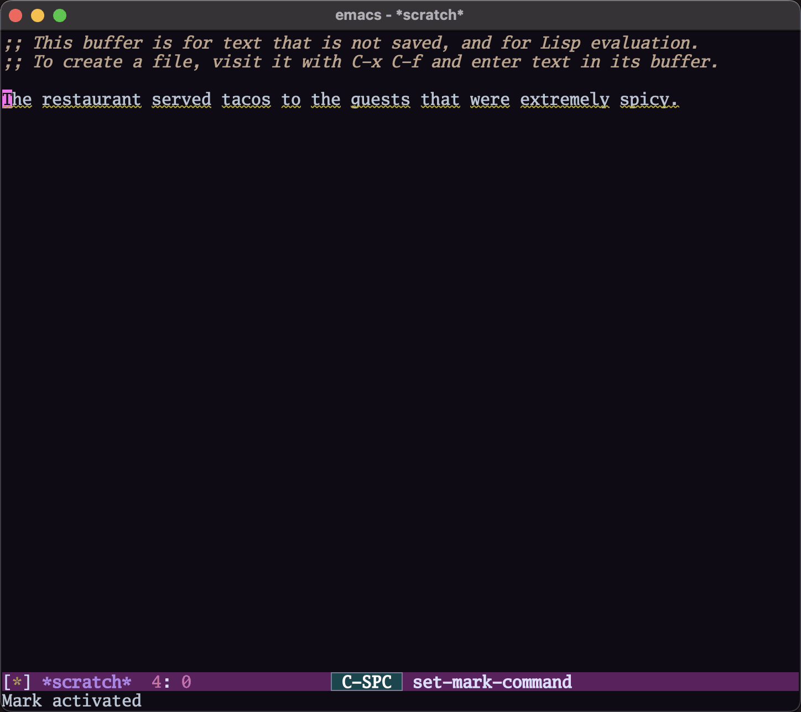

# Ellama

Ellama is a specialized client for Emacs that enables local access to
LLMs through [ollama](https://github.com/jmorganca/ollama)'s API. It
provides a suite of commands that allow users to query questions,
find word definitions, translate text, and more via the Emacs
interface. Ellama natively supports streaming output, providing
seamless integration with your text editor.

## Commands

### ellama-ask

Ask Ellama about something by entering a prompt in an interactive
buffer.

### ellama-ask-about

Ask Ellama about a selected region or the current buffer.

### ellama-translate

Ask Ellama to translate a selected region or word at the point.

### ellama-define-word

Find the definition of the current word using Ellama.

### ellama-summarize

Summarize a selected region or the current buffer using Ellama.

### ellama-code-review

Review code in a selected region or the current buffer using Ellama.

### ellama-change

Change text in a selected region or the current buffer according to a provided change.

### ellama-enhance-grammar-spelling

Enhance the grammar and spelling in the currently selected region or
buffer using Ellama.

### ellama-enhance-wording

Enhance the wording in the currently selected region or buffer using Ellama.

### ellama-make-concise

Make the text of the currently selected region or buffer concise and simple using Ellama.

### ellama-change-code

Change selected code or code in the current buffer according to a provided change using Ellama.

### ellama-enhance-code

Change selected code or code in the current buffer according to a provided change using Ellama.

### ellama-complete-code

Complete selected code or code in the current buffer according to a provided change using Ellama.

### ellama-add-code

Add new code according to a description, generating it with a provided context from the selected region or the current buffer using Ellama.

### ellama-render

Render the currently selected text or the text in the current buffer as a specified format using Ellama.

### ellama-make-list

Create a markdown list from the active region or the current buffer using Ellama.

### ellama-make-table

Create a markdown table from the active region or the current buffer using Ellama.

### ellama-summarize-webpage

Summarize a webpage fetched from a URL using Ellama.

## Configuration

The following variables can be customized for the Ellama client:

- `ellama-url`: The URL to call Ollama.
- `ellama-curl-executable`: The path to curl executable.
- `ellama-model`: The model to use Ollama with. Default model is [mistral](https://ollama.ai/library/mistral).
- `ellama-buffer`: The default Ellama buffer name.
- `ellama-always-show-buffer`: Whether to always show the Ellama buffer.
- `ellama-user-nick`: The user nick in logs.
- `ellama-assistant-nick`: The assistant nick in logs.
- `ellama-buffer-mode`: The major mode for the Ellama logs buffer.
  Default mode is `markdown-mode`.
- `ellama-language`: The language for Ollama translation. Default
  language is english.
- `ellama-template`: The template to use with Ollama instead of the default.

## Acknowledgments

Thanks [Jeffrey Morgan](https://github.com/jmorganca) for excellent
project [ollama](https://github.com/jmorganca/ollama). This project
cannot exist without it.

Thanks [zweifisch](https://github.com/zweifisch) - I got some ideas
from [ollama.el](https://github.com/zweifisch/ollama) what ollama
client in Emacs can do.

Thanks [Dr. David A. Kunz](https://github.com/David-Kunz) - I got more
ideas from [gen.nvim](https://github.com/David-Kunz/gen.nvim).
