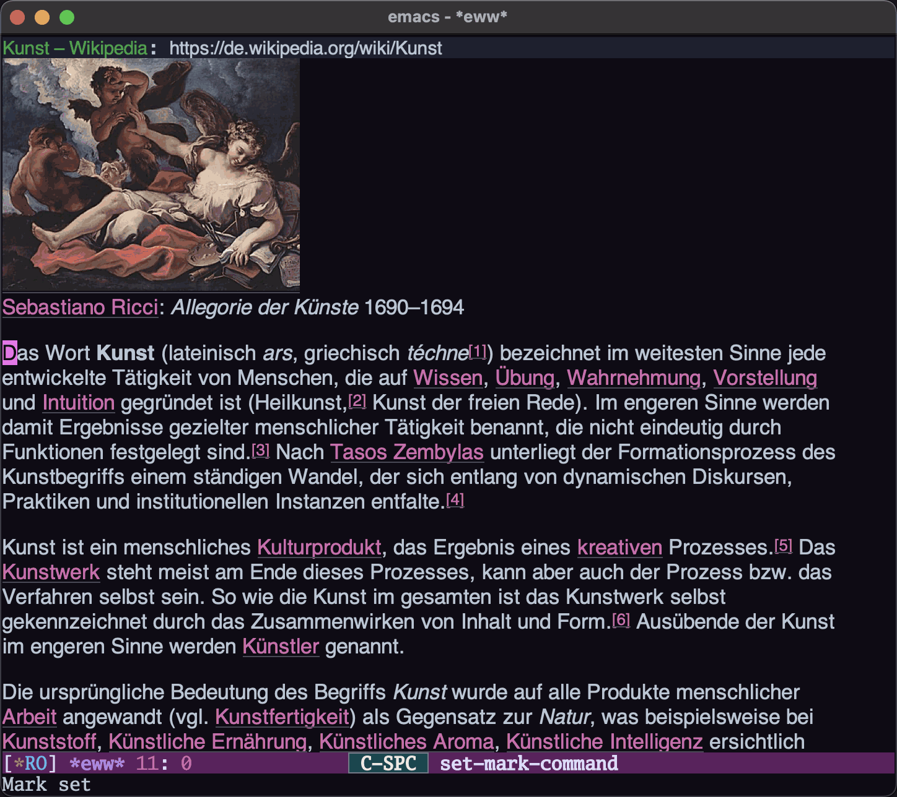

# Ellama

[](http://www.gnu.org/licenses/gpl-3.0.txt)
[](https://melpa.org/#/ellama)

Ellama is a tool for interacting with large language models from
Emacs. It allows you to ask questions and receive responses from the
LLMs. Ellama can perform various tasks such as translation, code
review, summarization, enhancing grammar/spelling or wording and
more through the Emacs interface. Ellama natively supports streaming
output, making it effortless to use with your preferred text editor.

## What's new

- `10.12.2023` - Added command `ellama-complete`.
- `17.11.2023` - Changes by ellama is now atomic. It can be useful if
  you want to undo this changes. Two new commands added:
  `ellama-ask-selection` and `ellama-ask-line`. Some cosmetic changes
  done.
- `28.10.2023` - Switched from
[ollama](https://github.com/jmorganca/ollama)'s API to [llm
library](https://elpa.gnu.org/packages/llm.html). [Many
providers](https://github.com/ahyatt/llm#setting-up-providers)
supported.

## Installation

Install the package `ellama` from
[MELPA](https://melpa.org/#/getting-started). Just `M-x`
`package-install`<kbd>Enter</kbd> `ellama` <kbd>Enter</kbd>.
By default it uses [ollama](https://github.com/jmorganca/ollama)
provider and [zephyr](https://ollama.ai/library/zephyr) model. If you
ok with it, you need to install
[ollama](https://github.com/jmorganca/ollama) and pull
[zephyr](https://ollama.ai/library/zephyr). You can use `ellama` with
other model or other llm provider. In that case you should customize
ellama configuration like this:

``` emacs-lisp
(use-package ellama
  :init
  (setopt ellama-language "German")
  (require 'llm-ollama)
  (setopt ellama-provider
		  (make-llm-ollama
		   :chat-model "zephyr:7b-alpha-q5_K_M" :embedding-model "zephyr:7b-alpha-q5_K_M")))
```

## Commands

### ellama-chat

Ask Ellama about something by entering a prompt in an interactive
buffer and continue conversation.

### ellama-ask

Alias for `ellama-chat`.


### ellama-ask-about

Ask Ellama about a selected region or the current buffer.


### ellama-ask-selection

Send selected region or current buffer to ellama chat.

### ellama-ask-line

Send current line to ellama chat.

### ellama-complete

Complete text in current buffer with ellama.

### ellama-translate

Ask Ellama to translate a selected region or word at the point.


### ellama-define-word

Find the definition of the current word using Ellama.


### ellama-summarize

Summarize a selected region or the current buffer using Ellama.


### ellama-code-review

Review code in a selected region or the current buffer using Ellama.


### ellama-change

Change text in a selected region or the current buffer according to a provided change.

### ellama-enhance-grammar-spelling

Enhance the grammar and spelling in the currently selected region or
buffer using Ellama.


### ellama-enhance-wording

Enhance the wording in the currently selected region or buffer using Ellama.

### ellama-make-concise

Make the text of the currently selected region or buffer concise and simple using Ellama.

### ellama-change-code

Change selected code or code in the current buffer according to a provided change using Ellama.

### ellama-enhance-code

Change selected code or code in the current buffer according to a provided change using Ellama.

### ellama-complete-code

Complete selected code or code in the current buffer according to a provided change using Ellama.

### ellama-add-code

Add new code according to a description, generating it with a provided context from the selected region or the current buffer using Ellama.

### ellama-render

Render the currently selected text or the text in the current buffer as a specified format using Ellama.

### ellama-make-list

Create a markdown list from the active region or the current buffer using Ellama.

### ellama-make-table

Create a markdown table from the active region or the current buffer using Ellama.

### ellama-summarize-webpage

Summarize a webpage fetched from a URL using Ellama.

## Configuration

The following variables can be customized for the Ellama client:

- `ellama-buffer`: The default Ellama buffer name.
- `ellama-user-nick`: The user nick in logs.
- `ellama-assistant-nick`: The assistant nick in logs.
- `ellama-buffer-mode`: The major mode for the Ellama logs buffer.
  Default mode is `markdown-mode`.
- `ellama-language`: The language for Ollama translation. Default
  language is english.
- `ellama-provider`: llm provider for ellama. Default provider is
  `ollama` with [zephyr](https://ollama.ai/library/zephyr) model.
  There are many supported providers: `ollama`, `open ai`, `vertex`,
  `GPT4All`. For more information see [llm
  documentation](https://elpa.gnu.org/packages/llm.html)
- `ellama-spinner-type`: Spinner type for ellama. Default type is
  `progress-bar`.

## Acknowledgments

Thanks [Jeffrey Morgan](https://github.com/jmorganca) for excellent
project [ollama](https://github.com/jmorganca/ollama). This project
cannot exist without it.

Thanks [zweifisch](https://github.com/zweifisch) - I got some ideas
from [ollama.el](https://github.com/zweifisch/ollama) what ollama
client in Emacs can do.

Thanks [Dr. David A. Kunz](https://github.com/David-Kunz) - I got more
ideas from [gen.nvim](https://github.com/David-Kunz/gen.nvim).

Thanks [Andrew Hyatt](https://github.com/ahyatt) for `llm` library.
Without it only `ollama` would be supported.
